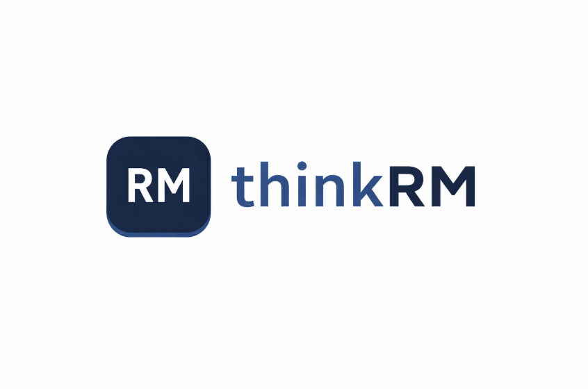
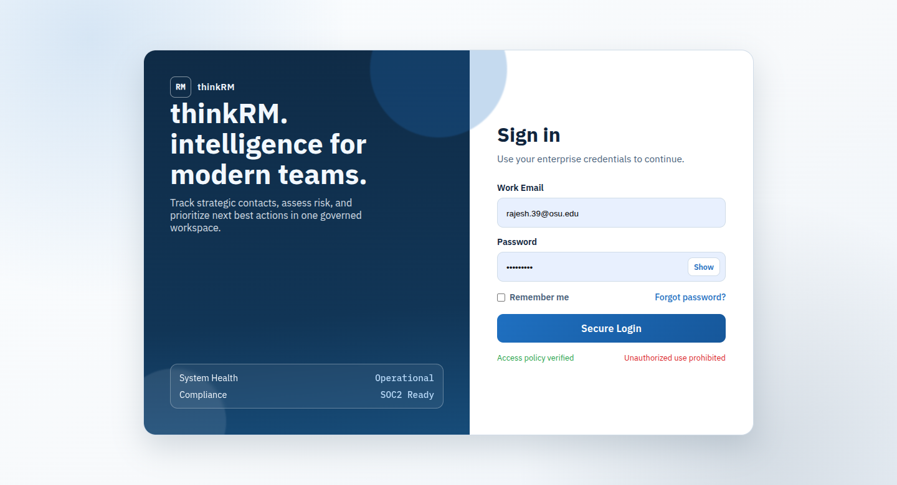
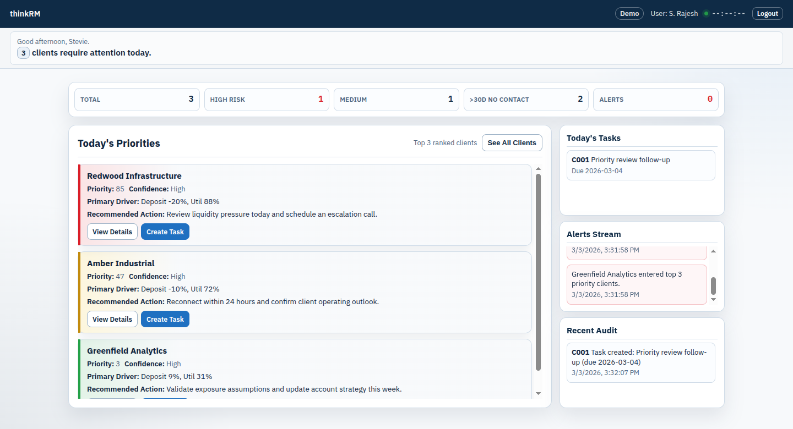
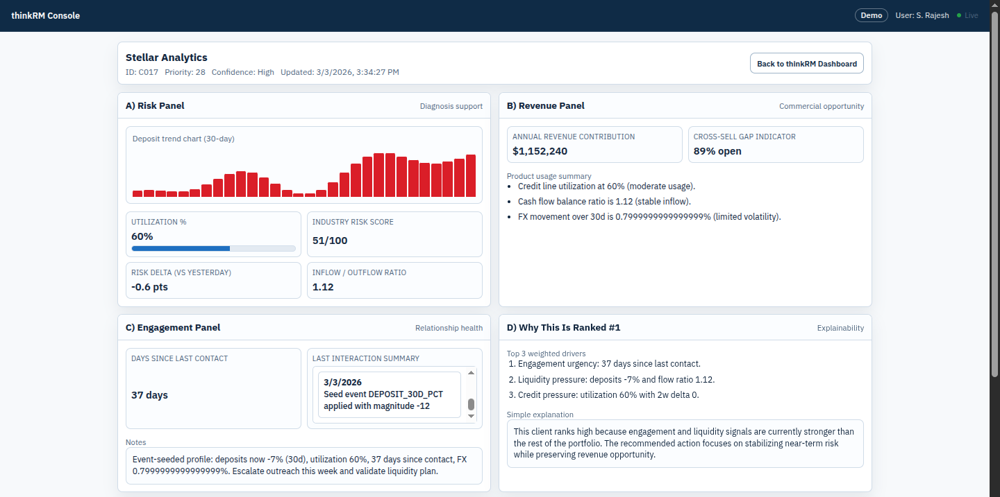
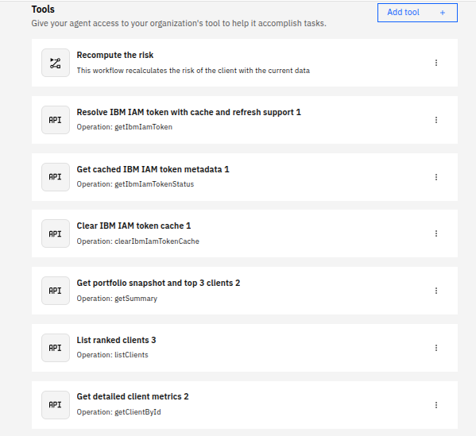
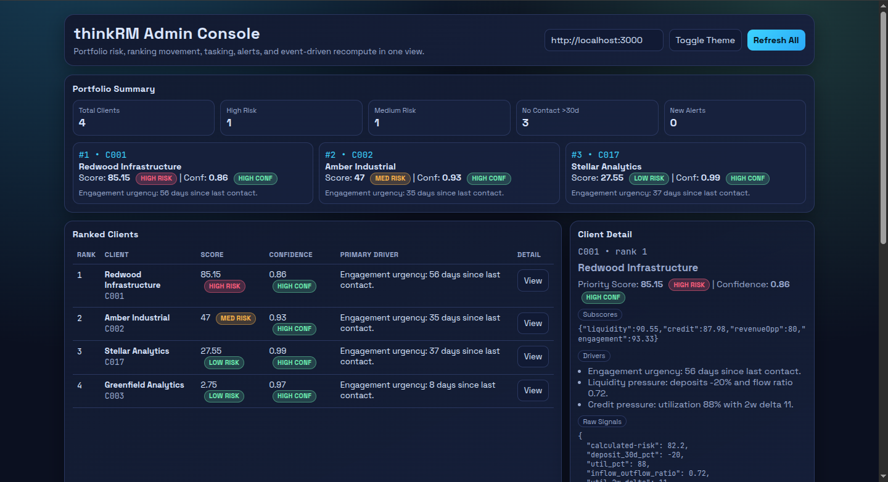
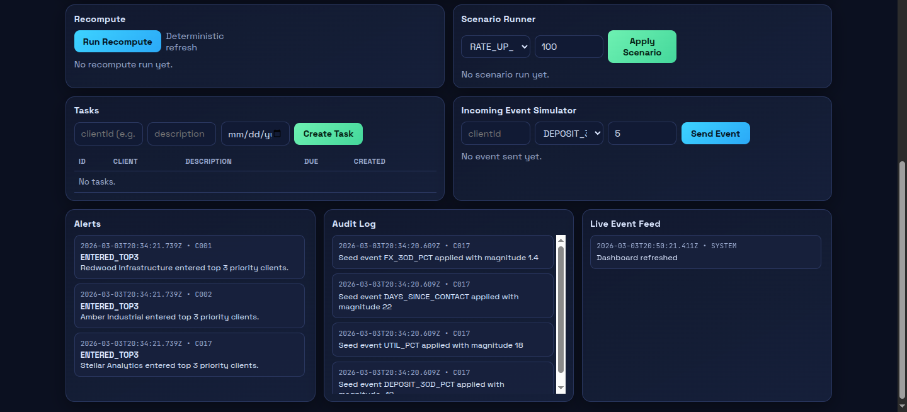

# Agentic AI Portfolio Optimization Engine for Relationship Managers

We built the Agentic AI intelligence layer most CRMs are missing: a deterministic engine that converts noisy portfolio signals into clear, ranked priorities for Relationship Managers (RMs). Instead of passive reporting, this project combines explainable scoring with watsonx Orchestrate workflows to drive action. The compute layer is deterministic and auditable; Agentic AI orchestration adds execution around those decisions.




## Problem

RMs often manage 40+ clients and must continuously balance:
- risk detection,
- revenue opportunity,
- engagement urgency.

Most CRMs are passive dashboards. They display data but do not reliably prioritize next best actions, coordinate operational follow-through, or deliver Agentic AI support for RM execution.

## Solution Overview

This Agentic AI system implements an end-to-end decision loop:
1. Portfolio signals are ingested per client.
2. Deterministic scoring computes risk, priority, and confidence.
3. Clients are ranked into actionable priorities.
4. Events trigger real-time recomputation.
5. Scenario simulations model "what-if" outcomes.
6. watsonx Orchestrate workflows trigger downstream actions.
7. The system drafts outreach, creates tasks, and records audit logs.

Safety model:
- Email generation is draft-only.
- No workflow auto-sends client communications.

## Architecture

- **Backend:** Node.js + Express API (`backend/server.js`)
- **Deterministic intelligence engine:** `backend/portfolioEngine.js`
- **Data model:** In-memory client/task/audit stores
- **UI:** HTML/CSS dashboards (`frontend/`)
- **Orchestration layer:** watsonx Orchestrate tools + Agentic AI workflow (Digital Employee integration)
- **Control plane:** Admin console for event simulation and live recompute

## Key Features

- Real-time portfolio recomputation after signal changes
- Deterministic risk scoring (0-100)
- Deterministic confidence modeling
- Priority ranking with top-client focus
- Scenario simulation (`RATE_UP_BPS`, `DEPOSIT_SHOCK_PCT`)
- Agentic AI-triggered workflow actions via watsonx Orchestrate
- Draft outreach generation (LLM-assisted, not auto-sent)
- Task generation for RM follow-up
- Audit trail for key portfolio and workflow actions

## Demo Walkthrough

1. Sign in and open the RM dashboard.
2. Review portfolio snapshot and current top priorities.
3. Trigger an input event (for example, deposit shock) in the admin console.
4. Watch the portfolio recompute and top priorities re-rank in real time.
5. Open a client detail view and inspect deterministic drivers/subscores.
6. Run a scenario simulation to evaluate forward risk.
7. Trigger Orchestrate workflow steps for operational follow-up.
8. Review drafted outreach (draft-only), created tasks, and audit entries.

## Screenshots

### 1) Sign-In Experience


This is the entry point for the RM experience and establishes a secure workflow handoff into the portfolio interface.

### 2) RM Dashboard


The dashboard presents portfolio snapshot metrics, ranked priorities, and operational panels so RMs can triage quickly.

### 3) Sample Client Detail (Workflow-Enriched, Audit-Verified)


This view shows a single client profile with deterministic scoring outputs and workflow-enriched context. All updates are traceable via audit logs.

### 4) Agentic Workflow in watsonx Orchestrate


This illustrates the Agentic AI tool-based orchestration layer used to trigger portfolio actions and coordinate RM workflows.

### 5) Admin Event Simulation Console



The admin console is used to inject simulated events and validate real-time portfolio recomputation and agent reactions.
The admin console is also where Agentic AI reactions can be validated under controlled event conditions.

## Technical Highlights (Resume-Oriented)

- Designed and implemented a deterministic portfolio scoring engine (risk/priority/confidence)
- Built an event-driven recomputation loop for dynamic priority updates
- Implemented scenario simulation endpoints for stress-testing client outcomes
- Integrated watsonx Orchestrate via Agentic AI tool-based workflows and OpenAPI contracts
- Structured Agentic AI workflows to separate deterministic compute from orchestration logic
- Implemented operational controls: tasking, auditability, and draft-only communication safety

## Local Setup

### Prerequisites
- Node.js 18+
- npm

### Run Locally
```bash
npm install
npm start
```

Open:
- `http://localhost:3000`

## watsonx Orchestrate Integration (Optional)

1. Set backend bearer auth token:
```bash
export ORCHESTRATE_API_TOKEN='replace-with-a-long-random-token'
```
2. Start backend:
```bash
npm start
```
3. Expose local server (example):
```bash
ngrok http 3000
```
4. Update server URL in `backend/openapi/orchestrate-api.yaml`.
5. Import OpenAPI tool:
```bash
orchestrate tools import -k openapi -f backend/openapi/orchestrate-api.yaml --app-id nodejs
```

Optional event push configuration:
```bash
export WO_EVENT_WEBHOOK_URL='https://your-watson-endpoint'
export WO_EVENT_BEARER_TOKEN='optional-bearer-token'
export WO_EVENT_API_KEY='optional-api-key'
export WO_EVENT_TIMEOUT_MS='5000'
```

## Determinism and Safety

- **Deterministic:** Risk scoring, priority scoring, confidence modeling, ranking, scenario outputs
- **Non-deterministic:** Email draft generation step in orchestration
- **Safety guardrail:** Draft generation only; no automatic outbound sending

## Future Improvements

- Persist data in a production-grade database
- Connect to real core banking / transaction feeds
- Scale to multi-portfolio and multi-RM tenancy
- Add approval-based automation chains for higher-trust execution
